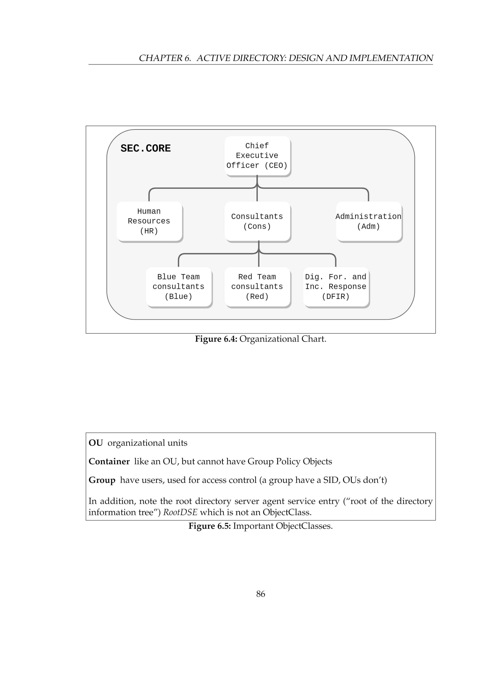

# Active Directory: Design and Implementation (compendia chapter 6)

Link til :
- [Erik sin gitlab](https://gitlab.com/erikhje/dcsg1005/-/tree/master)
- Scripts ogsånt - [heat-mono](https://gitlab.com/erikhje/heat-mono)

Todo: 
1. Set up the DC SEC.CORE as show in the [video from the previous week.](https://www.youtube.com/watch?v=pJF4xPFtqBk&ab_channel=YTGossin)

2. Opprett denne strukturen ved å kjøre medfølgende kommandoer:

 Kommandoene kjøres i sekvens. 
 ```
> # User OUs
> New-ADOrganizationalUnit 'AllUsers' -Description 'Containing OUs and users'

 New-ADOrganizationalUnit 'IT' -Description 'IT staff' `

   -Path 'OU=AllUsers,DC=sec,DC=core'

 New-ADOrganizationalUnit 'Cons' -Description 'Consultants' `

   -Path 'OU=AllUsers,DC=sec,DC=core'

 New-ADOrganizationalUnit 'Adm' -Description 'Administration' `

  -Path 'OU=AllUsers,DC=sec,DC=core'

New-ADOrganizationalUnit 'Blue' -Description 'Blue Team' `

  -Path 'OU=Cons,OU=AllUsers,DC=sec,DC=core'

New-ADOrganizationalUnit 'Red' -Description 'Red Team' `

  -Path 'OU=Cons,OU=AllUsers,DC=sec,DC=core'

New-ADOrganizationalUnit 'DFIR' -Description 'Dig For and Inc Resp' `

  -Path 'OU=Cons,OU=AllUsers,DC=sec,DC=core'

# Computer OUs
New-ADOrganizationalUnit 'Clients' -Description 'Containing OUs and users laptops'
New-ADOrganizationalUnit 'Servers' -Description 'Containing OUs and servers'
New-ADOrganizationalUnit 'Adm' -Description 'Adm laptops' `
  -Path 'OU=Clients,DC=sec,DC=core'
New-ADOrganizationalUnit 'Cons' -Description 'Consultants laptops' `
  -Path 'OU=Clients,DC=sec,DC=core'  
```
Så skal disse flyttes til OU'ene fra containeren de er i, ved å skrive 'get-adc

Prio list: 
1. Opprette Organizational Units
> New-ADOrganizationalUnit
2. Legger til brukere, og angir hvilken OU de skal tilhøre i samme slengen. Ellers havner de i Computers containeren. 
- Da flytter vi de ved: Get-ADComputer "MGR" | Move-ADObject -TargetPath "OU=Adm,OU=Clients,DC=sec,DC=core"
3. Sett opp GPO, og gjør aaaalt du vil av endringer.

Pass på så port 3389 ikke er åpen. 

[Adding users]()


 Heading	
# H1

## H2

### H3

Bold	
**bold text**

Italic	
*italicized text*

Blockquote	
> blockquote

Ordered List	
1. First item
2. Second item
3. Third item

Unordered List	
- First item
- Second item
- Third item

Code	                
`code`
Horizontal Rule	
---

Link	                
[title](https://www.example.com)

Image	                

